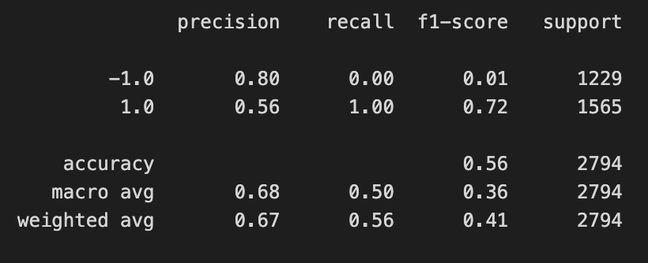

# Machine Learning Trading Bot

Create an algorithmic trading bot that learns and adapts to new data and evolving markets. 

## Background

Assume the role of a financial advisor at one of the top five financial advisory firms in the world. Your firm constantly competes with the other major firms to manage and automatically trade assets in a highly dynamic environment. In recent years, your firm has heavily profited by using computer algorithms that can buy and sell faster than human traders.

The speed of these transactions gave your firm a competitive advantage early on. But, people still need to specifically program these systems, which limits their ability to adapt to new data. You’re thus planning to improve the existing algorithmic trading systems and maintain the firm’s competitive advantage in the market. To do so, you’ll enhance the existing trading signals with machine learning algorithms that can adapt to new data.

## What You're Creating

You’ll combine your new algorithmic trading skills with your existing skills in financial Python programming and machine learning to create an algorithmic trading bot that learns and adapts to new data and evolving markets.

* Implement an algorithmic trading strategy that uses machine learning to automate the trade decisions.

* Adjust the input parameters to optimise the trading algorithm.

* Train a new machine learning model and compare its performance to that of a baseline model.

## Instructions

Full instructions are contained in the "Instructions.md" file.

### Establish a Baseline Performance

This coding can be found in the "machine_learning_trading_bot_BASELINE.ipynb" file.

Establish a baseline performance for the trading algorithm.

1. Import the OHLCV dataset into a Pandas DataFrame.

2. Generate trading signals using short- and long-window SMA values.

3. Split the data into training and testing datasets.

4. Use the `SVC` classifier model from SKLearn's support vector machine (SVM) learning method to fit the training data and make predictions based on the testing data. Review the predictions.

5. Review the classification report associated with the `SVC` model predictions.

6. Create a predictions DataFrame that contains columns for “Predicted” values, “Actual Returns”, and “Strategy Returns”.

7. Create a cumulative return plot that shows the actual returns vs. the strategy returns. Save a PNG image of this plot. This will serve as a baseline against which to compare the effects of tuning the trading algorithm.

### Tune the Baseline Trading Algorithm

In this section, you’ll tune, or adjust, the model’s input features to find the parameters that result in the best trading outcomes. (You’ll choose the best by comparing the cumulative products of the strategy returns.) To do so, complete the following steps:

1. Tune the training algorithm by adjusting the size of the training dataset. To do so, slice your data into different periods. Rerun the notebook with the updated parameters.

2. Tune the trading algorithm by adjusting the SMA input features. Adjust one or both of the windows for the algorithm. Rerun the notebook with the updated parameters.

3. Choose the set of parameters that best improved the trading algorithm returns. Save a PNG image of the cumulative product of the actual returns vs. the strategy returns, and document your conclusion in your `README.md` file.

### Evaluate a New Machine Learning Classifier

Use the original parameters that the starter code provided and apply them to the performance of a second machine learning model.

1. Import a new classifier, `LogisticRegression`.

2. Using the original training data as the baseline model, fit another model with the new classifier.

3. Backtest the new model to evaluate its performance. 
 
 
 
# Evaluation Report

## Baseline Analysis

The evaluation of the model started by setting the following parameters:
* Short Window = 4 Days
* Long Window = 100 Days

From here, we plotted the Strategy Returns:

We then split the data set into training and testing sets.  For this, we used a date offset of 3 months for the training set.

Using the StandardScaler, we fit and transformed the X_train and X_test data sets.

The `SVC` classifier model from SKLearn's support vector machine (SVM) learning method was used to fit the training data and make predictions based on the testing data.

The classification report for this method is as follows:

The strategy returns vs actuals returns when graphed as cummulative returns looks like:

As you can see from the graph, the Strategy Returns did perform better than actual returns.

## Tuning the Baseline Algorithm

### Tuning by adjusting the size of the training set

This coding can be found in the "machine_learning_trading_bot_ADJUST_SIZE.ipynb" file.

In this step, we used the same parameters as the baseline analysis, with the exception of the training set size.  For this turning, we used a date offset of 2 years (24 months) to see if this would improve the analysis.

The classification report for this adjustment is as follows:

The strategy returns vs actuals returns when graphed as cummulative returns looks like:

As you can see from the graph, the Strategy Returns did perform better than actual returns.

### Tuning by adjusting the sma window sizes

This coding can be found in the "machine_learning_trading_bot_ADJUST_SMA.ipynb" file.

In this step, we used the same parameters as the baseline analysis, with the exception of the SMA window sizes.  For this turning, we used the following to see if this would improve the analysis:
* Short Window = 10 Days
* Long Window = 125 Days

The classification report for this adjustment is as follows:

The strategy returns vs actuals returns when graphed as cummulative returns looks like:

As you can see from the graph, the Strategy Returns were pretty much equal to the Actual Returns.

## Evaluating using a New Machine Learning Classifier

In this step, the original parameters were used, however, instead of using the SVC classifier model, the Logistic Regression model was used.  

The classification report for this adjustment is as follows:

The strategy returns vs actuals returns when graphed as cummulative returns looks like:

As you can see from the graph, the Strategy Returns were worse than the Actual Returns, so this model is not a good model to use.

## SUMMARY

After preforming the various analysis and tuning the model in various ways, we can compare the graphs and reports to see which model performs the best.  Based on the Cummulative Returns, we can see that the SVC model with the following parameters performs the best:
* Short Window = 4 Days
* Long Window = 100 Days
* Train Data Set = 24 month offset
